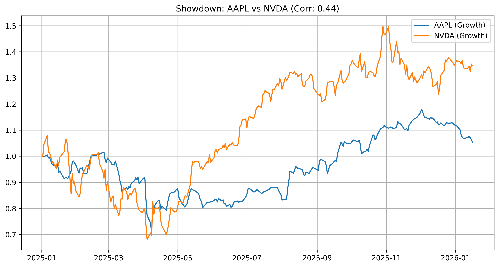

# Stock-Showdown-Analysis
# Stock Showdown: Comparative Asset Analysis Tool

# Apple vs. NVIDIA: The AI Sector Showdown

## 📊 Project Overview
This project provides a quantitative comparison between **Apple (AAPL)** and **NVIDIA (NVDA)** using 2025 market data. The analysis focuses on how the leader in AI hardware (NVIDIA) compares to the leader in consumer integration (Apple) in terms of stock performance and market volatility.

## 🛠️ Skills Demonstrated
* **Financial Data Pipelines**: Pulling real-time equity data using the `yfinance` API.
* **Normalization Techniques**: Scaling prices to a base of 1.0 to compare growth independent of share price.
* **Pandas Expertise**: Handling Datetime indexing and forward-filling data for consistent analysis.
* **Object-Oriented Visualization**: Using Matplotlib's `fig, ax` structure to generate high-fidelity charts.

## 🚀 Key Features
- **Automated Cleaning**: Removes null values and aligns trading days between stocks.
- **Benchmark Analysis**: Calculates the relative growth of $1 invested at the start of the year.
- **Robust Reporting**: Automatically exports analysis results to a high-resolution PNG for stakeholder review.

## 📈 Performance Visualization

